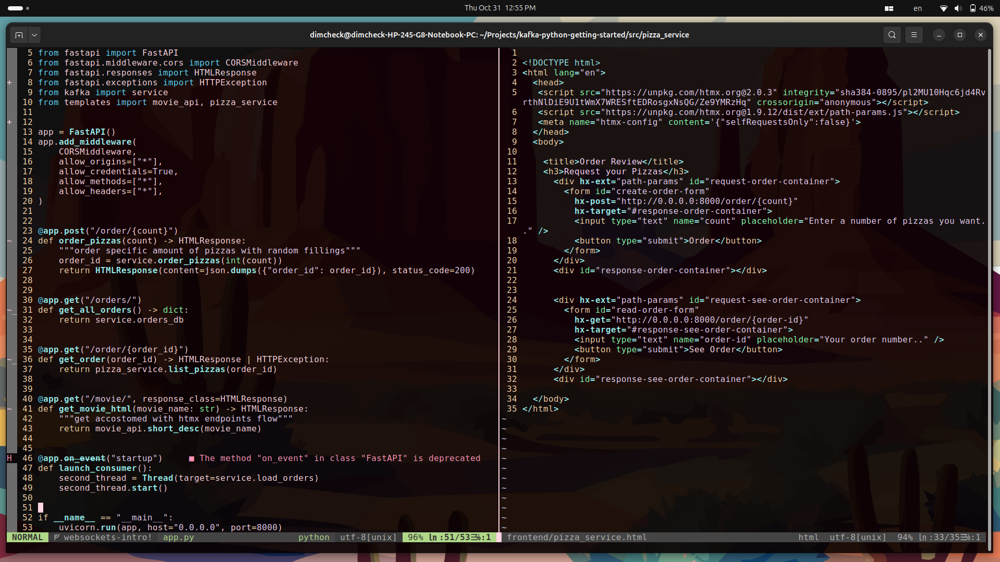

### About
- Create directory ~/.config/nvim
- Clone the repo
- Install [vim-plug](https://github.com/junegunn/vim-plug)
- Open nvim and run :PlugInstall
- Reopen nvim

Done, enjoy the final look✨:

